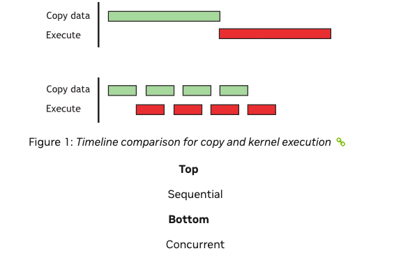
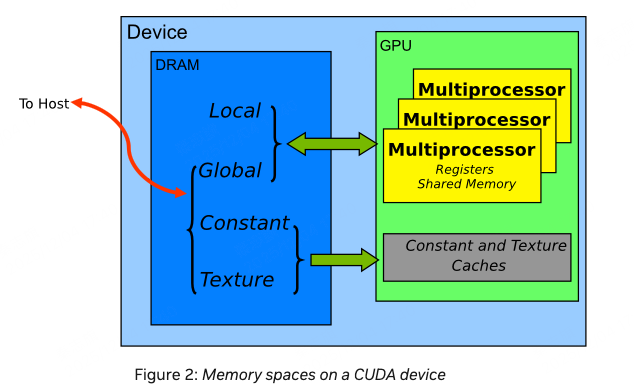
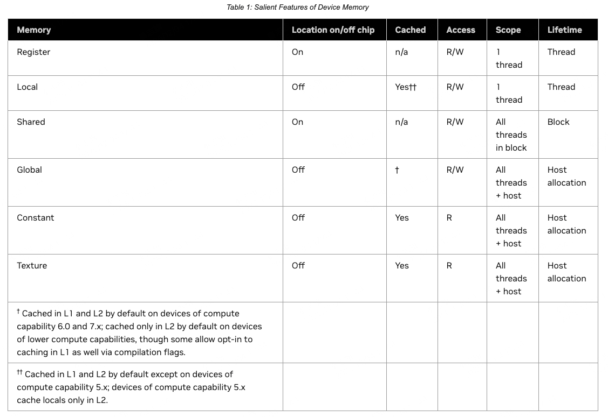
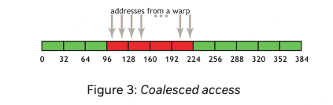
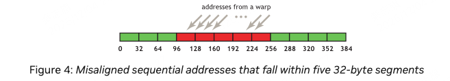

# 10.1 Data Transfer Between Host and Device
GPU device memorey的峰值带宽（是指的global memory的带宽），一般在898GB/s左右。比host的峰值带宽高很多（大概16GB/s）。
所以，要最小化host和device之间的数据传输。哪怕有些kernel cpu和gpu相比，gpu计算速度并没有快很多，也要将这部分计算放在gpu上，因为这可以减少cpu和gpu之间的数据传输。


此外，device和host之间的数据传输，也是有overhead的，所以将多次小的数据传输，合并为一次大的数据传输，会更高效。

为了解决这个问题，nv提供了pinned memorey机制，或者叫page-locked memory。锁页机制。
## 10.1.1 Pinned Memory
使用cudaHostAlloc 来分配锁页内存。nv提供的bandwidthTest中有使用的example。

由于pinned memory是稀缺资源，也不能过度使用它。

## 10.1.2 Aysnchronous and Overlapping Transfers with Computation
使用异步的copy来重叠计算和数据传输。cudaMemcpyAsync()。

``` c++
cudaMemcpyAsync(a_d, a_h, size, cudaMemcpyHostToDevice, 0);
kernel<<<grid, block>>>(a_d);
cpuFunction();
```
由于cudaMemcpyAsync和kernel都使用了stream 0.所以它们是同步的。
而cpuFunction可以和kernel这些并行起来。

我们可以使用流水线并行来优化数据传输和计算。

``` c++
size=N*sizeof(float)/nStreams;
for (i=0; i<nStreams; i++) {
    offset = i*N/nStreams;
    cudaMemcpyAsync(a_d+offset, a_h+offset, size, dir, stream[i]);
    kernel<<<N/(nThreads*nStreams), nThreads, 0,
             stream[i]>>>(a_d+offset);
}
```

可以看到，流水线并行效果还是不错的。

## 10.1.3 Zero Copy
Zero Copy可以让GPU Thread直接访问到host memory。这需要映射pinned memorey。

``` c++
float *a_h, *a_map;
...
cudaGetDeviceProperties(&prop, 0);
if (!prop.canMapHostMemory)
    exit(0);
cudaSetDeviceFlags(cudaDeviceMapHost);
cudaHostAlloc(&a_h, nBytes, cudaHostAllocMapped);
cudaHostGetDevicePointer(&a_map, a_h, 0);
kernel<<<gridSize, blockSize>>>(a_map);
```
1. 先在host上分配mapped pinned memory。
2. 然后将host的memory map到device memory。
3. 然后将map后的pointer传递给kernel。

zero copy虽然避免了拷贝，获得了性能提升。但是注意，device和host之间的读写速度是很慢的，gpu thread 访问pinned memory的速度，也比访问global memory慢很多。

此外，由于没有cache，每次访问pinned memory，都需要从host memory中读取数据。这是比较慢的。所以针对pinned memory，应该尽量减少访问次数。可以自己做cache。

## 10.1.4 Unified Virtual Addressing
UVA，统一虚拟地址空间。host、device以及其他支持的设备，都共享一套虚拟地址空间。

可以使用cudaPointerGetAttributes()来查询指针的属性，属于哪个device。
同时，UVA支持多个GPU之间的通信，peer-to-peer通信。通过PCIe或者NVLINK。

# 10.2 Device Memory Spaces




Global 和 local 都有cache。

## 10.2.1 Coalesced Access to Global Memory
如何优化对global memory的读写是非常重要的！
有一个结论，设计到硬件，除了shared memory，否则自动带入warp的视角。甚至shared memory也应该代入warp的视角，因为gpu是按照warp来执行的。

对于compute capability 6.0及以上的卡，一个warp内thread的并行访问会被组织为多个事务，每个事务的大小是32字节。

### 10.2.1.1 A Simple Access Pattern


可以看到，warp的读取是以32byte为最小单位进行的。这张图中，读取了4x32 bytes。
如果一个warp只需要读取32字节中的部分，warp也会完整读取32字节。
### 10.2.1.2 A Sequential but Misaligned Access Pattern

如果地址没有按照32字节对齐，那么warp会读取多个32字节，但是只使用其中的部分。

使用cudaMalloc()函数申请内存，会保证至少256字节对齐。

