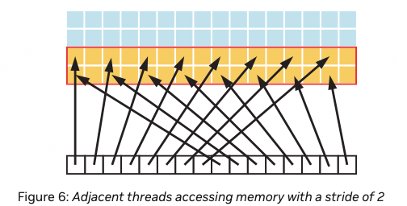
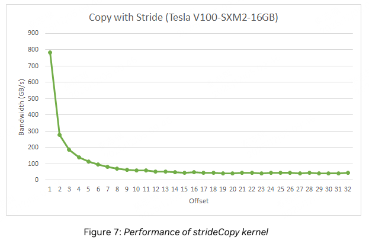
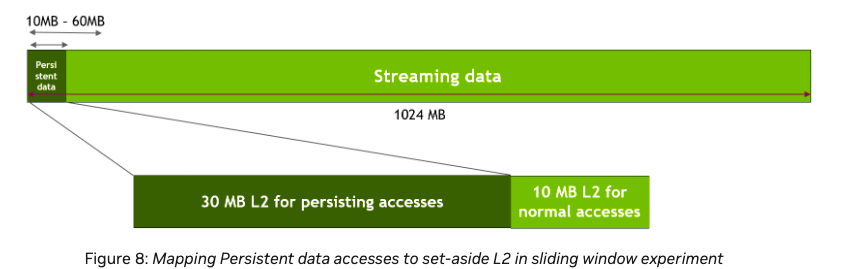
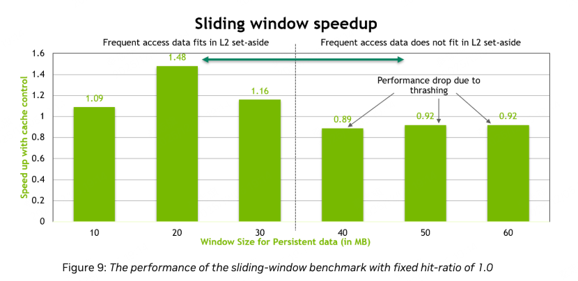

# 10.1 Data Transfer Between Host and Device
GPU device memorey的峰值带宽（是指的global memory的带宽），一般在898GB/s左右。比host的峰值带宽高很多（大概16GB/s）。
所以，要最小化host和device之间的数据传输。哪怕有些kernel cpu和gpu相比，gpu计算速度并没有快很多，也要将这部分计算放在gpu上，因为这可以减少cpu和gpu之间的数据传输。


此外，device和host之间的数据传输，也是有overhead的，所以将多次小的数据传输，合并为一次大的数据传输，会更高效。

为了解决这个问题，nv提供了pinned memorey机制，或者叫page-locked memory。锁页机制。
## 10.1.1 Pinned Memory
使用cudaHostAlloc 来分配锁页内存。nv提供的bandwidthTest中有使用的example。

由于pinned memory是稀缺资源，也不能过度使用它。

## 10.1.2 Aysnchronous and Overlapping Transfers with Computation
使用异步的copy来重叠计算和数据传输。cudaMemcpyAsync()。

``` c++
cudaMemcpyAsync(a_d, a_h, size, cudaMemcpyHostToDevice, 0);
kernel<<<grid, block>>>(a_d);
cpuFunction();
```
由于cudaMemcpyAsync和kernel都使用了stream 0.所以它们是同步的。
而cpuFunction可以和kernel这些并行起来。

我们可以使用流水线并行来优化数据传输和计算。

``` c++
size=N*sizeof(float)/nStreams;
for (i=0; i<nStreams; i++) {
    offset = i*N/nStreams;
    cudaMemcpyAsync(a_d+offset, a_h+offset, size, dir, stream[i]);
    kernel<<<N/(nThreads*nStreams), nThreads, 0,
             stream[i]>>>(a_d+offset);
}
```

可以看到，流水线并行效果还是不错的。

## 10.1.3 Zero Copy
Zero Copy可以让GPU Thread直接访问到host memory。这需要映射pinned memorey。

``` c++
float *a_h, *a_map;
...
cudaGetDeviceProperties(&prop, 0);
if (!prop.canMapHostMemory)
    exit(0);
cudaSetDeviceFlags(cudaDeviceMapHost);
cudaHostAlloc(&a_h, nBytes, cudaHostAllocMapped);
cudaHostGetDevicePointer(&a_map, a_h, 0);
kernel<<<gridSize, blockSize>>>(a_map);
```
1. 先在host上分配mapped pinned memory。
2. 然后将host的memory map到device memory。
3. 然后将map后的pointer传递给kernel。

zero copy虽然避免了拷贝，获得了性能提升。但是注意，device和host之间的读写速度是很慢的，gpu thread 访问pinned memory的速度，也比访问global memory慢很多。

此外，由于没有cache，每次访问pinned memory，都需要从host memory中读取数据。这是比较慢的。所以针对pinned memory，应该尽量减少访问次数。可以自己做cache。

## 10.1.4 Unified Virtual Addressing
UVA，统一虚拟地址空间。host、device以及其他支持的设备，都共享一套虚拟地址空间。

可以使用cudaPointerGetAttributes()来查询指针的属性，属于哪个device。
同时，UVA支持多个GPU之间的通信，peer-to-peer通信。通过PCIe或者NVLINK。

# 10.2 Device Memory Spaces


Global 和 local 都有cache。

## 10.2.1 Coalesced Access to Global Memory
如何优化对global memory的读写是非常重要的！
有一个结论，设计到硬件，除了shared memory，否则自动带入warp的视角。甚至shared memory也应该代入warp的视角，因为gpu是按照warp来执行的。

对于compute capability 6.0及以上的卡，一个warp内thread的并行访问会被组织为多个事务，每个事务的大小是32字节。

### 10.2.1.1 A Simple Access Pattern


可以看到，warp的读取是以32byte为最小单位进行的。这张图中，读取了4x32 bytes。
如果一个warp只需要读取32字节中的部分，warp也会完整读取32字节。
### 10.2.1.2 A Sequential but Misaligned Access Pattern

如果地址没有按照32字节对齐，那么warp会读取多个32字节，但是只使用其中的部分。

使用cudaMalloc()函数申请内存，会保证至少256字节对齐。

### 10.2.1.3 Effects of Misaligned Accesses
想要验证地址不对齐对性能的影响，可以用kernel进行实验。
``` c++
__global__ void offsetCopy(float *odata, float* idata, int offset)
{
    int xid = blockIdx.x * blockDim.x + threadIdx.x + offset;
    odata[xid] = idata[xid];
}
```


可以看到，不同的offset，对性能的影响是不同的。当offset是32字节的倍数时，性能是最优的。

上面kernel，每个thread从global memory中读取一个float，然后写入global memory。一个warp有32个thread，所以一个warp需要读取4x32=128字节。即4个32字节的transaction。
当地址不对齐时，每个warp需要读取5个transaction，而不是4个。

### 10.2.1.4 Strided Accesses

虽然没对齐，但由于global memory的访问有cache，所以从结果看不是很明显。
``` c++
__global__ void strideCopy(float *odata, float* idata, int stride)
{
    int xid = (blockIdx.x*blockDim.x + threadIdx.x)*stride;
    odata[xid] = idata[xid];
}
```

为什么有32字节的transaction size？因为warp访问global memory，是有L2 Cache的，L2 Cache的line size是32字节。



### 10.2.1.4 Strided Access
``` c++
__global__ void strideCopy(float *odata, float* idata, int stride)
{
    int xid = (blockIdx.x*blockDim.x + threadIdx.x)*stride;
    odata[xid] = idata[xid];
}
```
stride =2 的时候，有一半的transaction是无效的。等于4的时候，有3/4的transaction是无效的。
直到每个thread读取的地址相隔32字节，再往后，性能就不变了。
因为再往大，一个warp都是读取32个transaction。不会再变了。




## 10.2.2 L2 Cache
从cuda 11.0、compute capability 8.0开始，支持在L2 Cache中 persistence of data。
因为L2 Cache是on-chip，相较于global mmeory，它能提供更高的带宽和更低的延迟。

### 10.2.2.1 L2 Cache Window
如果cuda kernel需要重复访问global memorey的同一个区域，那么这个区域可以做成persisting。
如果cuda kernel对global memory的一个区域，只需要访问一次，那么考虑做成streaming的。
可以将L2 Cache的一部分用于persistent accesses。
``` c++
cudaGetDeviceProperties(&prop, device_id);
cudaDeviceSetLimit(cudaLimitPersistingL2CacheSize, prop.persistingL2CacheMaxSize); /* Set aside max possible size of L2 cache for persisting accesses */
```
可以设置persisting L2 Cache的大小。

``` c++
cudaStreamAttrValue stream_attribute;                                         // Stream level attributes data structure
stream_attribute.accessPolicyWindow.base_ptr  = reinterpret_cast<void*>(ptr); // Global Memory data pointer
stream_attribute.accessPolicyWindow.num_bytes = num_bytes;                    // Number of bytes for persisting accesses.
stream_attribute.accessPolicyWindow.hitRatio  = 1.0;                          // Hint for L2 cache hit ratio for persisting accesses in the num_bytes region
stream_attribute.accessPolicyWindow.hitProp   = cudaAccessPropertyPersisting; // Type of access property on cache hit
stream_attribute.accessPolicyWindow.missProp  = cudaAccessPropertyStreaming;  // Type of access property on cache miss.

//Set the attributes to a CUDA stream of type cudaStream_t
cudaStreamSetAttribute(stream, cudaStreamAttributeAccessPolicyWindow, &stream_attribute);
```
通过配置stream_attribute的accessPolicyWindow属性，来将global memory的一个区域，配置为persisting accesses。

注意，由于L2 Line是一个有限的资源，如果persisting accesses的区域太大，那么会导致L2 Cache的miss rate增加。因此，可以通过调整hitRatio来平衡L2 Cache的miss rate和bandwidth。

### 10.2.2.2 Tuning the Access Window Hit-Ratio
假设hitRatio是0.6，则一次对这个区域的访问中，60%的区域是persisting accesses，40%的区域是streaming accesses。


文章中进行了一个实验，用NVIDIA Tesla A100GPU，它有40MB的L2 Cache。实验使用1024MB大小的global memory。设置了固定的30 MB 大小的L2 set-aside 区域。
当实验中 persist size 小于30MB时，都能获得性能收益，最大有50%。
但是当persist size 大于30MB时，性能就会出现下降。
``` c++
__global__ void kernel(int *data_persistent, int *data_streaming, int dataSize, int freqSize) {
    int tid = blockIdx.x * blockDim.x + threadIdx.x;

    /*Each CUDA thread accesses one element in the persistent data section
      and one element in the streaming data section.
      Because the size of the persistent memory region (freqSize * sizeof(int) bytes) is much
      smaller than the size of the streaming memory region (dataSize * sizeof(int) bytes), data
      in the persistent region is accessed more frequently*/

    data_persistent[tid % freqSize] = 2 * data_persistent[tid % freqSize];
    data_streaming[tid % dataSize] = 2 * data_streaming[tid % dataSize];
}

stream_attribute.accessPolicyWindow.base_ptr  = reinterpret_cast<void*>(data_persistent);
stream_attribute.accessPolicyWindow.num_bytes = freqSize * sizeof(int);   //Number of bytes for persisting accesses in range 10-60 MB
stream_attribute.accessPolicyWindow.hitRatio  = 1.0;                      //Hint for cache hit ratio. Fixed value 1.0
```


为了平衡L2 Cache的miss rate和bandwidth，需要根据实验结果，调整hitRatio。
``` c++
stream_attribute.accessPolicyWindow.base_ptr  = reinterpret_cast<void*>(data_persistent);
stream_attribute.accessPolicyWindow.num_bytes = 20*1024*1024;                                  //20 MB
stream_attribute.accessPolicyWindow.hitRatio  = (20*1024*1024)/((float)freqSize*sizeof(int));  //Such that up to 20MB of data is resident.
```

我们通过hitRatio，保证实际cache的区域最多就20MB。修改之后，性能如下：


