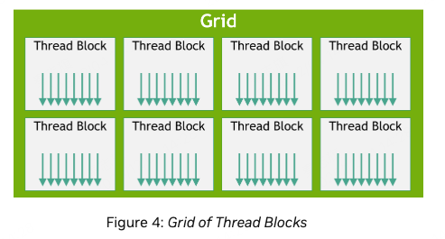
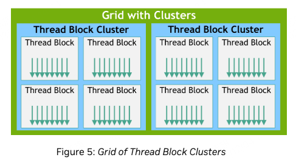
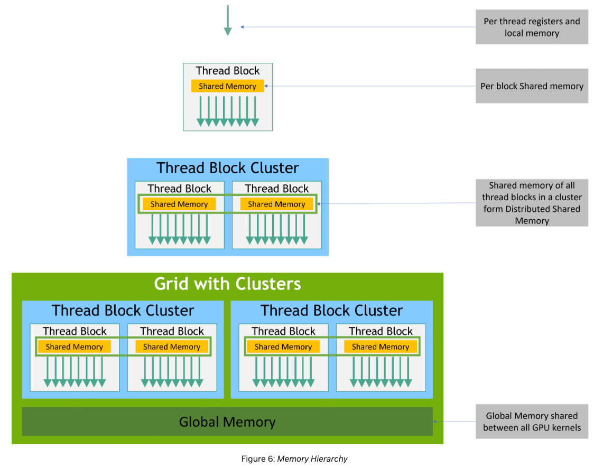
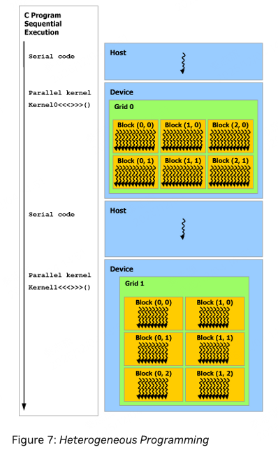

# 5.1 kernel
``` c++
// Kernel definition
__global__ void VecAdd(float* A, float* B, float* C)
{
    int i = threadIdx.x;
    C[i] = A[i] + B[i];
}

int main()
{
    ...
    // Kernel invocation with N threads
    VecAdd<<<1, N>>>(A, B, C);
    ...
}
```
__global__修饰的函数，是device函数。

# 5.2 Thread Hierarchy


grid 有三个维度，block也有三个维度。
## 5.2.1 Thread Block Clusters
从Hoppper架构（compute capability 9.0开始），每个SM上有多个thread block cluster。每个cluster有多个thread block。
一个thread block cluster中的thread block 会被调度到同一个GPC(GPU Processing Cluster)上运行。
与block类似，cluster同样有三个维度。


一个cluster中有多少block，是由用户决定的，但有最大限制， 一般是8个。具体由cudaOccupancyMaxPotentialClusterSize函数返回。

``` c++
// Kernel definition
// Compile time cluster size 2 in X-dimension and 1 in Y and Z dimension
__global__ void __cluster_dims__(2, 1, 1) cluster_kernel(float *input, float* output)
{

}

int main()
{
    float *input, *output;
    // Kernel invocation with compile time cluster size
    dim3 threadsPerBlock(16, 16);
    dim3 numBlocks(N / threadsPerBlock.x, N / threadsPerBlock.y);

    // The grid dimension is not affected by cluster launch, and is still enumerated
    // using number of blocks.
    // The grid dimension must be a multiple of cluster size.
    cluster_kernel<<<numBlocks, threadsPerBlock>>>(input, output);
}
```
`__cluster_dims__(2, 1, 1)` 表示一个cluster包含两个ctx。

## 5.2.2 BLocks as Clusters
还有另外一种方式：
``` c++
// Implementation detail of how many threads per block and blocks per cluster
// is handled as an attribute of the kernel.
__block_size__((1024, 1, 1), (2, 2, 2)) __global__ void foo();

// 8x8x8 clusters.
foo<<<dim3(8, 8, 8)>>>();
```

# 5.3 Memory Hierarchy

对于hopper以及更新的架构，有四个层级的memory：
1. thread register
2. shared memory
3. cluster distributed shared memory
4. global memory

对于hopper以前的架构，则只有三层memory：

1. thread register
2. shared memory
3. global memory

# 5.4 Heterogeneous Programming

cuda编程是在host和device两个设备上进行的，两个设备的memory默认是隔离的，不能直接访问对方的memory。
对于unified memory，host和device可以直接访问对方的memory。具体看第24小节。

