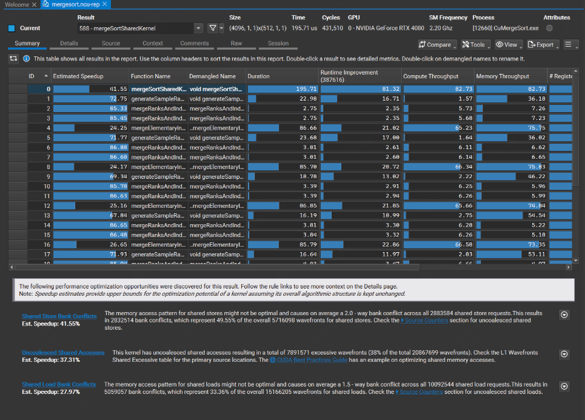

# 1 Header

描述了header各个按钮的作用。

# 2 Report Pages

## Summary Page

总结页会列出所有kernel，以及每个kernel的最重要的指标，以及每个kernel的优化建议。

## Details Page
Details Page由很多子section组成。每个子section包含一个header table，以及一个可选的可展开的body。