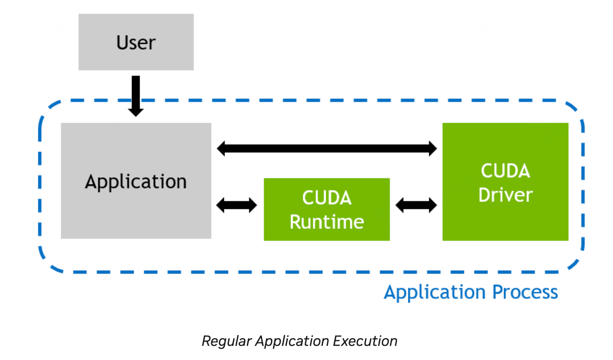
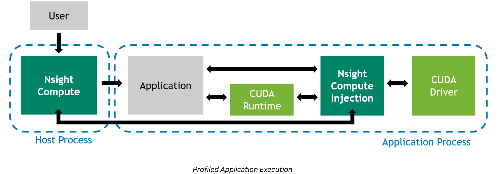

# 1 Profiling Applications
用户在启动一个cuda程序的时候，程序会直接和用户态的cuda driver交互，也可能和cuda runtime交互。

在使用ncu进行profile的时候，用户会使用ncu来启动cuda程序，ncu会注入一些测量的library，这些library会在cuda程序运行的时候被调用，来收集测量数据。

相当于劫持了对cuda driver的调用，来收集测量数据。