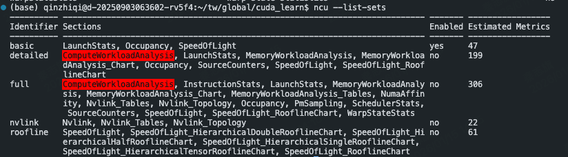

由于cuda指标实在太多，我们预定义了一些集合，用户可以根据自己的需求来选择收集哪些指标。

# 1 sets and sections
ncu使用section sets来定义指标集合，每个set由一个或多个section组成。每个section由一或多个有关联的指标组成。
由于不同类型的section对kernel产生的overhead不一样，用户可以根据自己的需求来选择收集哪些指标。
默认情况下，ncu只会收集很少的指标，以避免产生大的overhead。默认的是basic set。当--set, --section, --metrics都没设置的时候，就是用的默认的basic set。如果--set full, 则会收集所有的指标。

使用--list-sets可以查看所有可用的set。使用--list-sections可以查看所有可用的section。

共22个section，似乎也不是特别复杂。

可以编写一个.ncu-ignore文件，来指定哪些section不收集指标。

# 2 Sections and Rules

表格：
|section名称|描述|
|---|---|
|ComputeWorkloadAnalysis|对SM的计算资源的详细分析，包括指令时钟达成率 instruction per clock(IPC)、每个pipeline的利用率等|
|InsturctionStats|SASS指令执行的统计|
|LaunchStats|kernel的launch配置，grid dim、block size这些|
|MemoryWorkloadAnalysis|对GPU memory资源的详细分析|
|NUMA Affinity|所有GPU层面，基于计算、内存距离的非统一内存访问（NUMA）亲和性分析|
|Nvlink|NVLink利用率高层维度的分析|
|NvLink_Tables|每个NVLink的具体指标|
|Nvlink_topology|NVLink 拓扑分析|
|Occupany|占用率分析是在warp层面，统计每个multiprocessor上活跃的warp数量与最大支持的warp数量的比例|
|PM Sampling|每个指标随时间的变化|
|PM Sampling: Warp States|warp state指标随时间的变化|
|SchedulerStats|调度器发射指令活动的统计，每个调度器维护了一个它可以发射指令的warps pool，pool里面warp数上限由kernel启动参数决定。每个调度器在每个cycle会选择一个可发射的warp来发射，如果没有可发射的warp，则跳过。|
|SourceCounters|包含branch efficiency和smapled warp stall原因。warp stall sampling metrics是在kernel运行的时候被周期性采集，这个指标表示warp处于stall状态，不能被调度器执行。|
|SpeedOfLight|GPU 计算和内存资源的利用率|
|WarpStateStats|kernel执行期间warp消耗的cycles的统计分析|

# 3 Replay
根据选择的指标的情况，kernel可能需要被执行多次。这是因为并非所有的指标都可以在一个kernel运行中被采集到。例如，一次性从硬件获取的指标数量是有限制的。