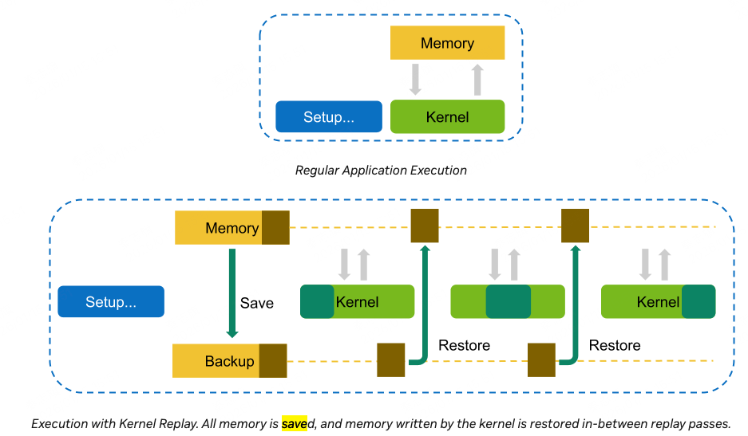
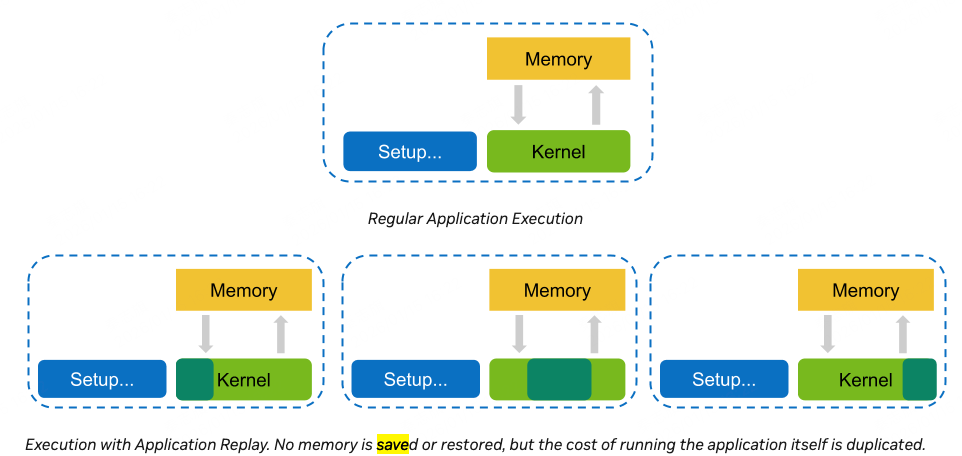
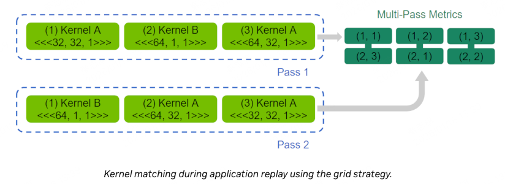
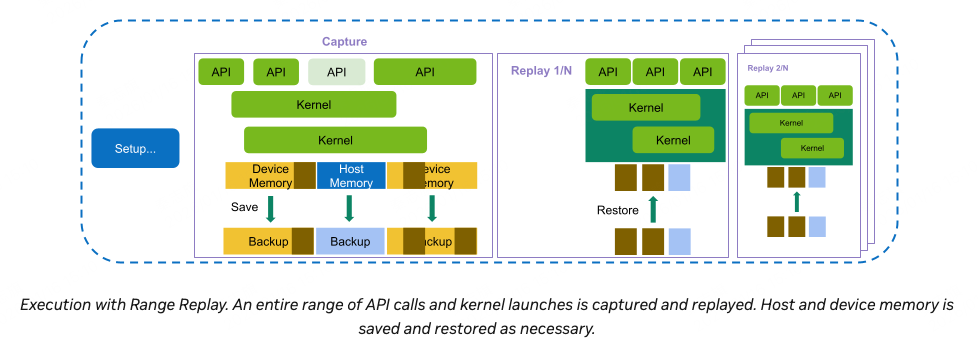

由于cuda指标实在太多，我们预定义了一些集合，用户可以根据自己的需求来选择收集哪些指标。

# 1 sets and sections
ncu使用section sets来定义指标集合，每个set由一个或多个section组成。每个section由一或多个有关联的指标组成。
由于不同类型的section对kernel产生的overhead不一样，用户可以根据自己的需求来选择收集哪些指标。
默认情况下，ncu只会收集很少的指标，以避免产生大的overhead。默认的是basic set。当--set, --section, --metrics都没设置的时候，就是用的默认的basic set。如果--set full, 则会收集所有的指标。

使用--list-sets可以查看所有可用的set。使用--list-sections可以查看所有可用的section。

共22个section，似乎也不是特别复杂。

可以编写一个.ncu-ignore文件，来指定哪些section不收集指标。

# 2 Sections and Rules

表格：
|section名称|描述|
|---|---|
|ComputeWorkloadAnalysis|对SM的计算资源的详细分析，包括指令时钟达成率 instruction per clock(IPC)、每个pipeline的利用率等|
|InsturctionStats|SASS指令执行的统计|
|LaunchStats|kernel的launch配置，grid dim、block size这些|
|MemoryWorkloadAnalysis|对GPU memory资源的详细分析|
|NUMA Affinity|所有GPU层面，基于计算、内存距离的非统一内存访问（NUMA）亲和性分析|
|Nvlink|NVLink利用率高层维度的分析|
|NvLink_Tables|每个NVLink的具体指标|
|Nvlink_topology|NVLink 拓扑分析|
|Occupany|占用率分析是在warp层面，统计每个multiprocessor上活跃的warp数量与最大支持的warp数量的比例|
|PM Sampling|每个指标随时间的变化|
|PM Sampling: Warp States|warp state指标随时间的变化|
|SchedulerStats|调度器发射指令活动的统计，每个调度器维护了一个它可以发射指令的warps pool，pool里面warp数上限由kernel启动参数决定。每个调度器在每个cycle会选择一个可发射的warp来发射，如果没有可发射的warp，则跳过。|
|SourceCounters|包含branch efficiency和smapled warp stall原因。warp stall sampling metrics是在kernel运行的时候被周期性采集，这个指标表示warp处于stall状态，不能被调度器执行。|
|SpeedOfLight|GPU 计算和内存资源的利用率|
|WarpStateStats|kernel执行期间warp消耗的cycles的统计分析|

# 3 Replay
根据选择的指标的情况，kernel可能需要被执行多次。这是因为并非所有的指标都可以在一个kernel运行中被采集到。例如，一次性从硬件获取的指标数量是有限制的。

## kernel replay

在kernel replay中，所有需要采集的指标被划分为一个或多个pass。对于第一个pass，所有kernel访问到的gpu memory会被保存下来。在第一个pass结束后，这个kernel写入哪些memory确定了。
在后续的pass中，为了保持一致，会先将写入的memory恢复到第一次pass运行前的状态。

这样就引入了ncu的save-and-restore overhead。
注意，如果只有一个pass，就没有save-and-restore overhead。

## Application Replay
在Application Replay中，所有指标也会被划分为一个或多个pass。与kernel replay不同的是，app replay会重复运行整个程序。每次运行都会收集一个pass的指标。
app replay没有save-and-restore overhead。此外，还可以diable cache control，这在一些场景下是有帮助的。

此外，如果host和device存在交互，kernel replay除了第一个pass可以正常交互，其他pass都不能交互。但是app replay可以正常交互。

但是app replay也有缺点，如果setup很耗费时间，每次运行都需要重新setup，这会增加运行时间。

在多轮运行中，ncu会将同一个kernel的指标聚合在一起。这里存在一个匹配机制，用来解决哪些指标是同一个kernel的。默认是grid 策略，是通过kernel name+grid size来匹配的。如果kernel name相同，grid size也相同，就通过执行顺序来匹配。

这张图有点难看懂。其实是在表示每轮pass中，每个kernel是哪个kernel。
对于pass1，grid (1,1) (1,2), (1,3)
表示kernel A是1号kernel，kernel B是2号kernel，blockDim.x=64的A是3号kernel。
对于pass2，grid是(2,3) (2,1) (2,2)
grid的第一个参数是pass的index，第二个参数是kernel的index。
对于pass2，第3个kernel对应pass1的第1个kernel，第1个kernel对应pass1的第2个kernel，第2个kernel对应pass1的第3个kernel。

**grid策略有点难理解。**

## Range Replay

同样地，所有被收集的指标被划分为一个或多个pass。与kernel replay和app replay不同的是，range reploy不是按单个kernel采集指标，而是按照一个整段cuda执行区间来采集指标。

range replay需要指定profile的范围。需要指定开始和结束标志。
标记可以是profiler start/stop API。也可以是NVTX Ranges。

## Application Range Replay
和range replay类似。

## Graph Profiling
可以以cuda graph为单位，进行整图的profile。

# 4 Compatibility
略

# 5 Profile Series

就是可以搜索启动参数，寻找最优的kernel启动参数。

# 6 Overhead
由于测量产生的overhead，由很多因素决定。
## Number and type of collected metrics
启动参数、硬件属性这些指标，没有任何运行时开销。
但是software-patched 指标，会有一定的运行时开销。

出于正确性、低overhead的考虑， 一个pass只会收集部分指标，如果指标太多，会分成多个pass进行收集。

## Number of profiled kernels
默认情况下，所有kernel的指标都会被收集。ncu也提供了过滤指令，可以指收集感兴趣的kernel的指标。

## GPU Architecture
不同GPU架构，会有不同的overhead。unit数量、L2 cache大小等。

