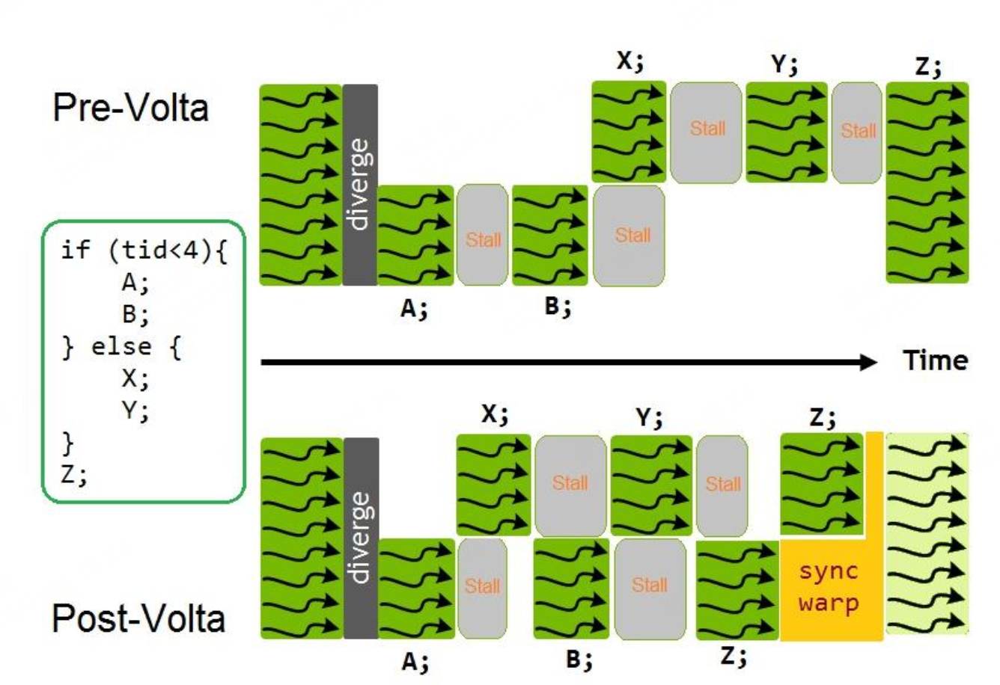
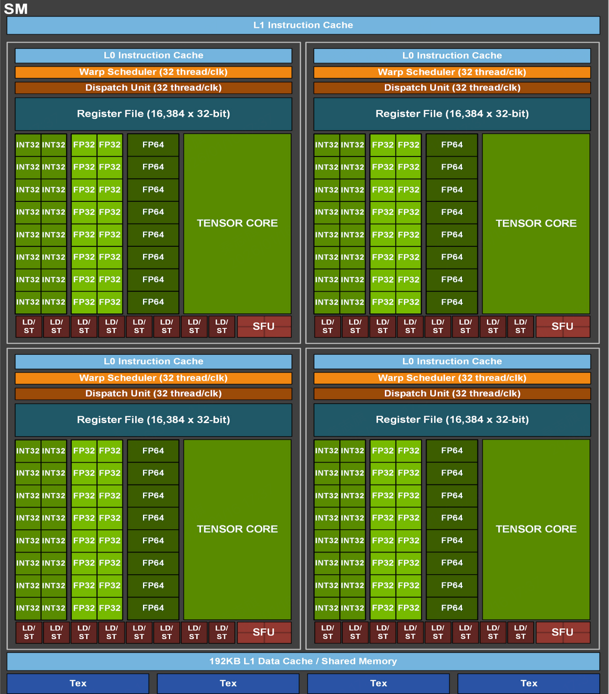

# 1 Hardware Model

## Compute Model

计算结构是Grid、Block、Thread。
还有cta的概念，warp的概念。

## Streaming Multiprocessor (SM)

SM上实现了一个名为SIMT的执行模式。要描述SIMT，我们需要聚焦到warp。warp内的32个线程，每个thread有自己单独的control flow，同时也作为warp的一部份一起执行。

每个thread维护自己的执行状态，包括一个执行PC和call stack。
independent thread scheduling

https://zhuanlan.zhihu.com/p/186192189

这张图解释得很好，独立线程调度应用后，虽然一个warp内的线程在执行时，只能执行相同PC的指令。但是当一个分支发生stall时，另外一个分支的线程可以继续执行。这样提高了并行度。

每个SM被划分为四个block，称为SM sub partitions。每个sub partition由下列组件组成：
- warp scheduler
- register file，nv的寄存器大小是32bit。
- execution units/pipelines/cores
  - integer execution units：nv在硬件层面，只有对int32的硬件支持，其他类型都是通过计算管线操作的（特殊指令除外，如dp4a等）
  - floating point execution units：nv硬件层面，有FP32和FP64（比如A100）两种ALU，FP16这些都是通过FP计算管线， 最终用FP32的ALU资源。
  - memory load/store units
  - special function unit：主要负责sqrt、rsqrt、sin、cos等复杂数学计算。
  - tensor cores

这四个SM共享：
- L1 Data Cache / Shared memory
- Texture units
- RT cores 如果有的话。RT core是光线追踪的硬件加速单元。

一个warp被分配到一个sub partition，然后在后续的时间（从launch到完成）这个warp都驻留在这个sub partition中。

这个warp有两种状态：active、resident。
sub partition 有固定大小的warp pool，比如16。
处于active的warp，如果已经准备好要发射指令了，就会进入eligible状态。

如果一个warp在等待下列事件，就会进入stalled状态（空闲状态）：
- 一个instruction fetch
- 一个内存依赖（由memory指令导致）
- 一个执行依赖（由上一个指令导致）
- 一个sync指令（如barrier、__syncthreads等）

编译器能决定最重要的资源就是一个kernel使用的寄存器的数量。每个sub partition都有固定大小的32bit的寄存器。

## Compute Preemption

计算抢占机制避免了运行时间长的kernel垄断GPU。代价是会有context的切换overhead。执行的context（包含registers、shared memory等）在抢占发生时被保存，后面执行时再次被加载。cuda也支持使用exclusive-process模式来避免抢占。

## Memory
nv gpu memory包括：global、local、shared、constant、texture、surface、register。一共7种。每种memory有不同的大小、latency、访问模式。

### global memory

global memory是49bit的虚拟地址空间，映射到device上的实际物理内存。它是pinned system memory，或者是peer memory。

Global memory 一般是通过SM的L1 cache、L2 cache进行读取。

49bit 对应大小是512TB。 

pinned system memory是指cpu端内存被锁定，不会被操作系统换出。好处是减少PCIe拷贝开销，支持zero-copy数据访问。

peer memory是指在多个GPU的场景中，GPU A 可以访问GPU B的global memory（peer-to-peer）。

至于为什么是49bit，是因为硬件成本限制、MMU/TLB限制。

### local memory
local memory是每个thread私有的，一般是device kernel 函数中的自变量。