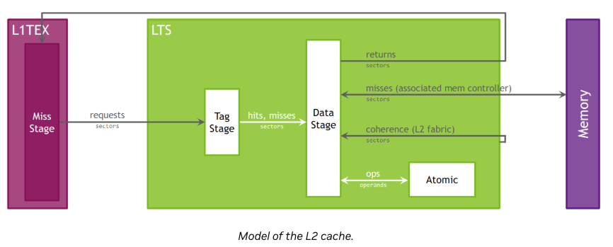
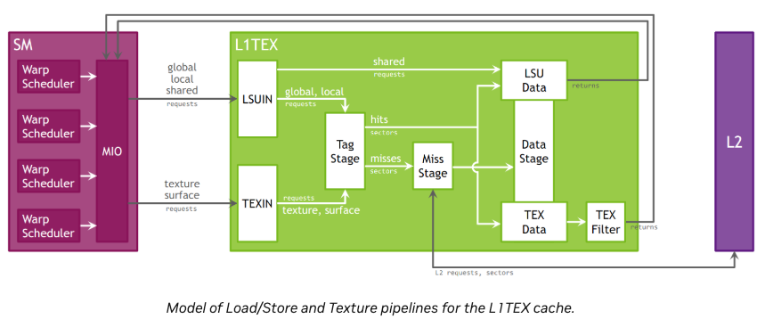

# 1 Hardware Model

## Compute Model

计算结构是Grid、Block、Thread。
还有cta的概念，warp的概念。

## Streaming Multiprocessor (SM)

SM上实现了一个名为SIMT的执行模式。要描述SIMT，我们需要聚焦到warp。warp内的32个线程，每个thread有自己单独的control flow，同时也作为warp的一部份一起执行。

每个thread维护自己的执行状态，包括一个执行PC和call stack。
independent thread scheduling

https://zhuanlan.zhihu.com/p/186192189


这张图解释得很好，独立线程调度应用后，虽然一个warp内的线程在执行时，只能执行相同PC的指令。但是当一个分支发生stall时，另外一个分支的线程可以继续执行。这样提高了并行度。

每个SM被划分为四个block，称为SM sub partitions。每个sub partition由下列组件组成：
- warp scheduler
- register file，nv的寄存器大小是32bit。
- execution units/pipelines/cores
  - integer execution units：nv在硬件层面，只有对int32的硬件支持，其他类型都是通过计算管线操作的（特殊指令除外，如dp4a等）
  - floating point execution units：nv硬件层面，有FP32和FP64（比如A100）两种ALU，FP16这些都是通过FP计算管线， 最终用FP32的ALU资源。
  - memory load/store units
  - special function unit：主要负责sqrt、rsqrt、sin、cos等复杂数学计算。
  - tensor cores

这四个SM共享：
- L1 Data Cache / Shared memory
- Texture units
- RT cores 如果有的话。RT core是光线追踪的硬件加速单元。

一个warp被分配到一个sub partition，然后在后续的时间（从launch到完成）这个warp都驻留在这个sub partition中。

这个warp有两种状态：active、resident。
sub partition 有固定大小的warp pool，比如16。
处于active的warp，如果已经准备好要发射指令了，就会进入eligible状态。

如果一个warp在等待下列事件，就会进入stalled状态（空闲状态）：
- 一个instruction fetch
- 一个内存依赖（由memory指令导致）
- 一个执行依赖（由上一个指令导致）
- 一个sync指令（如barrier、__syncthreads等）

编译器能决定最重要的资源就是一个kernel使用的寄存器的数量。每个sub partition都有固定大小的32bit的寄存器。

## Compute Preemption

计算抢占机制避免了运行时间长的kernel垄断GPU。代价是会有context的切换overhead。执行的context（包含registers、shared memory等）在抢占发生时被保存，后面执行时再次被加载。cuda也支持使用exclusive-process模式来避免抢占。

## Memory
nv gpu memory包括：global、local、shared、constant、texture、surface、register。一共7种。每种memory有不同的大小、latency、访问模式。

### global memory

global memory是49bit的虚拟地址空间，映射到device上的实际物理内存。它是pinned system memory，或者是peer memory。

Global memory 一般是通过SM的L1 cache、L2 cache进行读取。

49bit 对应大小是512TB。 

pinned system memory是指cpu端内存被锁定，不会被操作系统换出。好处是减少PCIe拷贝开销，支持zero-copy数据访问。

peer memory是指在多个GPU的场景中，GPU A 可以访问GPU B的global memory（peer-to-peer）。

至于为什么是49bit，是因为硬件成本限制、MMU/TLB限制。

### local memory
local memory是每个thread私有的，一般是device kernel 函数中的自变量。
它是global memory，也挺慢的，不是寄存器。
编译器会在以下场景中将自变量分配到local memory：
- 下标不是编译器常量的数组，比如float x = a[i]；
- 太大的数组，比如float a[256]。因为寄存器资源是有限且珍贵的，线程用寄存器多了，会导致占用降低。所以编译器就尝试直接丢了local memory。
- 寄存器溢出。当kernel计算很复杂，inlining很多、unrolling多、模版展开爆炸时，寄存器需求大于硬件上限，编译器只能把一部分本该在寄存器里的变量，溢出到local memory。

local memory会对性能造成很大的影响，尽量不要有local memory的读写。local memory的访问模式是full coalesced。这点和global memory不同。

为了最小化local memory的影响，我们可以：
- 优先用prefer registers。
- 利用shared memory。
- 增加可用寄存器数量。
- 增加L1 cache的大小。如果local memory不可避免，尝试让local memory的访问命中cache。
- 如果cache竞争激烈，尝试用non-caching global memory load。

### Shared memory

每个SM上的shared memory是on-chip的。on-chip是指在物理上是集成在GPU芯片内部的，而不是在芯片外部的显存颗粒里面。on-chip一般快。

shared memory有32个bank，32个连续word可以被映射到32个bank，同时访问。

当然，如果两个word落到了同一个bank，就会发生bank conflict。
如果两个thread访问相同的地址，则会发生broadcast，一个thread在收到数据后，会broadcast到其他thread。

## Cache

gpu上所有单元都是通过L2 cache来访问global memory的。L2 cache位于on-chip memory和framebuffer之间。这里的framebuffer是指gpu芯片外的显存，也就是global memory。

L2 在物理地址层面工作，除了cache能力，L2也可以实现压缩和全局原子操作的能力。



每个TPC有两个L1 cache，每个SM有一个L1 cache。需要注意，L1 cache、shared data、texture cache这些都是同一个东西。

L1 从两个单元接收请求：SM和TEX。L1 从SM接收到global memory、local memory的请求。从TEX接收到texture和surface的请求。
这些操作都是L2 先从global memory读取数据，然后缓存到L1 cache。



## Texture/Surface

TEX单元负责texture fetching 和filtering。
这部分不用关注。

# 2 Metrics Structure

## Metrics Overview
ncu的指标原始数值都是一些计数器，比如指令数、访存次数等，ncu能体现这些指标离理论峰值还有多远。
吞吐率指标会返回他们计数器的最大百分比。但并不是所有的指标都能拿来和理论峰值做比较，比如只统计命中L1的load等指标。

每个计数器有两类峰值：瞬时峰值、稳定峰值。瞬时峰值是一个时钟周期能达到的最大的峰值，稳定峰值是在一个长时间段内能达到的最大峰值。一般看稳定峰值。

## Metrics Entities
### Counters
计数器类型的指标

每个指标都统计了 sum、avg、max、min 这几个值。
此外，还有这些子项：
- .peak_sustained：稳定的峰值
- .peak_sustained_active：在单元active期间，稳定的峰值
- .peak_sustained_active.per_second：在单元active期间，稳定的峰值，以秒为单位统计
- .peak_sustained_elapsed：在整个kernel运行时间内，稳定的峰值
- .peak_sustained_elapsed.per_second：在整个kernel运行时间内，稳定的峰值，以秒为单位统计
- .per_second：每秒统计的指标数量
- .per_cycle_active：仅统计active cycle，每个cycle统计的指标数量
- .per_cycle_elapsed：在整个kernel运行时间内，每个cycle统计的指标数量
- .pct_of_peak_sustained_active：仅统计active cycle，稳定峰值达成的百分比
- .pct_of_peak_sustained_elapsed：在整个kernel运行时间内，稳定峰值达成的百分比
### Ratios

比率类型指标
有三种子指标：
- .pct 百分比
- .ratio 比率
- .max_rate，最大的比率

### Throughputs
吞吐量表示一个gpu的指标，与该指标理论峰值的比率。每个吞吐量指标有下列子指标：
- .pct_of_peak_sustained_active：仅统计active cycle，稳定峰值达成的百分比
- .pct_of_peak_sustained_elapsed：在整个kernel运行时间内，稳定峰值达成的百分比

吞吐量的指标，是有底层指标来支撑的。

## Cycle Metrics

计数器使用cycle作为时间单位。unit-level cycle指标包括：
- unit__cycles_elapsed：一段范围内的cycle数量。
- unit__cycles_active：unit处理数据的cycle数量。
- unit__cycles_stalled：unit在等待其他unit完成操作的cycle数量。
- unit__cycles_idle：unit处于闲置的cycle数量。

接口层面cycle计数器一般有下列指标：
- unit__(interface)_active：数据从src unit搬运到dst unit的cycle数量
- unit__(interface)_stalled：src unit有数据，但是dst没有接收到数据的cycle数量。

## Instanced Metrics

ncu的metric是有结构的，不是简单的一坨数。有的指标只有一个值，有的指标有多个值，有的两者都有。

# 3 Metrics Decoder

略

# 4 Units

这一节描述了nv gpu上的硬件单元。指标是围绕这些硬件单元来收集、统计的。
可以分为6类：
- 芯片/系统级互连（SoC/封装级）。描述的是GPU和外部世界如何连：
  - ctc：nvlink c2c
  - nvltx/nvlrx：nvlink 发送、接收
  - sys/syslrc/syslts：系统内存、peer memory的L2路径
- DRAM/内存控制器路径（物理内存）
  - dram：gpu主存
  - fbpa：L2 <-> DRAM之间的内存控制分区
  - mcc：Memory Controller Channel
  - vidlrc：专门给video/global memory的LRC
- L2 Cache体系（全芯片共享）
  - ltc：整个L2 cache
  - lts：单个L2 slice
  - ltcfabric：L2 slices之间的互连
  - lrc：L2请求合并器
  - xcomp/gxc：写压缩/读解压
- GPC/TPC级（片上中层）
  - gpc：general processing cluster
  - tpc：thread processing cluster
  - gcc：gpc级常量缓存
  - icc：TPC级指令缓存
- SM内部
  - sm：streaming multiprocessor
  - smsp：SM子分区（warp 调度&执行单元）
  - l1tex：L1/Texture Cache
  - dcc/idc/imc：不同类型的常量缓存
- 前端/调度/监控
  - fe：frontend，driver->GPU的入口
  - gr：Graphics/ compute engine
  - pm：performance monitor

# 5 Subunits

ncu中metric命名通常长这样：
<unit>__<subunit>_<op>_<属性>
比如l1tex__t_sectors_pipe_lsu_mem_global_op_ld.sum，其中pipe_lsu、mem_global都是subunit。
Subunit = “这次访问，面向的内存类型 / 接口 / 路径是谁”

# 6 Pipelines
pipeline执行指令，一些pipeline是物理层面的，比如对应物理硬件。另外一些pipeline是逻辑层面的，比如他们是有一个或多个物理pipeline组成。aggregated pipeline表示这种逻辑层面的pipeline，sub pipeline则表示这种物理层面pipeline。

这里pipeline可以理解为一个操作。比如alu pipeline，它是进行聚合计算的，包括位计算、逻辑运算等。
这里需要在硬件层面思考了，一个指令，比如add，它会调用一个或者多个pipeline来实现。同一个指令可能跑在不同的pipeline上。比如动态选择，一个fp32的add，可能根据调度器的决策，去FMAHeavy，或者去FMALite等。
有些指令会使用多个pipeline，比如即消耗ALU资源，又消耗FMA资源。所以，pipeline利用率加起来可能超过100%。

# 7 Quantities
- instruction。是指汇编指令，SASS。每个指令会生成0或多个request。
- request。操作硬件的指令，比如从global memory加载数据。每个请求会访问1或多个sector。request 里包含：warp中最多32个线程。每个线程的地址。request 是 送进 L1TEX 的最小命令单位。
- sector。cache line或者device memory中的32字节对齐的memory。L1或者L2 cache line是四个sector，128 字节。如果命中cache（tag存在，sector-data在cache line中），则会将这个访问归类于hit。否则归类于miss。这是扇区的概念，1 sector = 32 字节。1 cache line = 128B = 4 sectors。L1 / L2 都是 128B cache line。即使你只读 4B，只要落在一个 sector，就要把整个 sector 搬进来。
- cache line的key。一个request可能会访问多个tag。L1和L2都有128字节的cache line。
- wavefront。L1TEX 的“周期级工作包”。L1TEX 每 cycle 能处理的最大工作包。wavefront = 一次 pipeline 通过量。同一个 wavefront 内：多个 sector并行处理，不同 wavefront：串行，一个 cycle 一个。👉 wavefront 数 ≈ L1TEX pipeline 被占用的 cycle 数

L1TEX是SM内的子系统之一。是 SM（Streaming Multiprocessor）里的一级纹理/数据缓存单元，是一个复合概念，不仅仅是缓存，还包含纹理/共享内存访问的流水线处理。管理 纹理（Texture）、共享内存（Shared）、局部/全局内存的访问，通常与 LSU（Load Store Unit） 配合，在 Volta 及之后架构里，L1TEX 取代了之前的 separate texture cache / shared memory pipelines。

``` 
SM
 ├─ ALU / FMA / Tensor Core
 ├─ LSU (Load/Store Unit)
 │    └─ 发起内存请求 → L1TEX
 └─ L1TEX
      ├─ Tag Stage
      ├─ Miss Stage
      └─ Data Stage
```
除了寄存器的访问，其他memory相关的操作，都经过L1TEX。

执行流程：
当一个sm内为一个warp 执行一个global或者local memory指令的时候，会生成一个request给L1TEX。这个request中包含这个warp内32个thread的信息。这个request可能会需要访问多个cache line，以及这些cache line里面的多个sector。

wavefront 是L1TEX每个cycle能处理的最大工作包。如果所需的cache line或者sector不能被一个wavefront处理完，就会分成多个wavefront。

# 8 Range and Precision

## Overview
如果你发现ncu的指标和你预期的不一样，原因可能有多个。ncu不会对这些异常的指标做修饰，而是直接显示出来。
## Asynchronous GPU activity
profile的时候，gpu有可能也同时在给其他进程提供服务。一些资源是共享的，包括L2、DRAM、PCIe、NVLink等。如果profile的kernel本身很轻量，那么其他进程的活动对profile的结果也会有影响。比如DRAM的结果。为了避免这个问题，可以在profile时干掉其他进程，独占显卡进行profile。
## Multi-pass data collection

指标可能会出现out-of-range的情况，这是由于profiler会replay kernel，不同replay之间，kernel的负载情况不同，且差异大导致的。

以hit rate这个指标为例，如果每次replay，kernel的load balance不同（latency大于20us），那么hit rate也会不同。这样测出来的指标就有问题。


为了解决这个问题，可以适度增加负载，以达到稳定状态。此外，也可以减少同时收集的指标。

