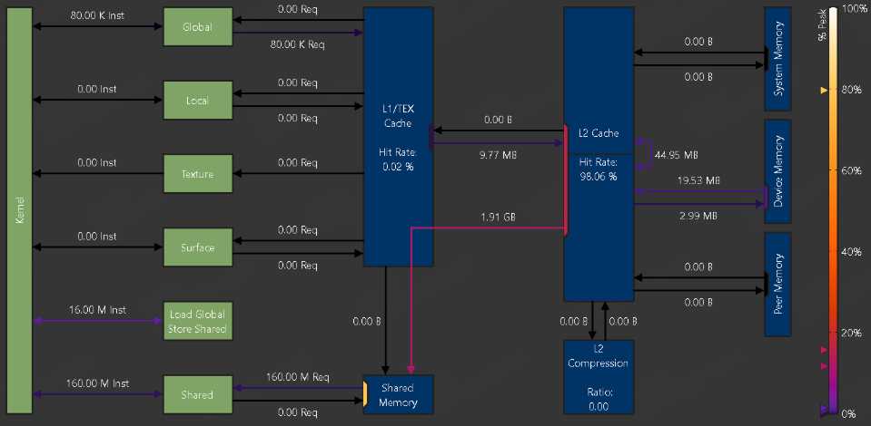

# 1 Overview

## Logical units
logical unit 是绿色或者灰色（没激活状态）。包括：
- kernel：在GPU SM上执行的cuda kernel。
- Global：CUDA global memory。
- Local：CUDA local memory。
- Texture：CUDA texture memory。
- Surface：CUDA surface memory。
- Shared：CUDA shared memory。
- Local Global Store Shared：是指直接从global memory中读取数据到shared memory中，不经过临时寄存器的访问。

## Physical units

物理单元是蓝色部分。或者灰色（未激活状态）。包括：
- L1/TEX Cache：L1或者Texture Cache。这是除了用户自己管理的shared memory以外的L1缓存。
- Shared memory：用户自己管理的shared memory。
- L2 Cache：L2 Cache。
- L2 Compression：L2 Cache的压缩单元。
- System Memory ：系统内存。cpu的，不是gpu的。
- Device Memory：on-chip的device memory。这里的写法有问题，不是on-chip。
- Peer Memory：其他GPU的on-chip memory。

## Links
kernel和其他logical unit之间的连接，表示kernel有多少指令用到了这些logical unit。例如，kernel和global之间的连接表示kernel有多少指令写入或者读取了global memory。

注意，A100卡的Load Global Store Shared指令比较特殊，需要单独拿出来分析。因为它是直接从global memory中读取数据到shared memory中，不经过临时寄存器的访问。

logical unit和physical unit之间的连接，表示它们之间request提出的数量。比如，L1/TEX和Global之间的连接表示global load指令生成的request数量。

每条连接线的颜色表示利用率。如果连接线是灰色，则表示利用率为0。

## Ports

端口这个概念是physical unit的概念，physical unit中，可能存在多个link 共用一个端口的情况，每条路看起来都不堵，但门已经挤满了，所以整个单元已经到极限。

比如L2，读和写往往共用一个数据端口，不是每个方向一条独立高速通道。

真正的瓶颈在 port，而不是 link。

类比：高速公路 + 收费站，Links = 多条高速公路，Port = 收费站窗口，Unit = 收费站整体。情况是：每条高速都不堵，但收费站窗口只有一个，所有车都要从这个窗口过。👉 窗口打满 = 性能瓶颈。

比较容易出现这个问题的是：L2 Cache、L1TEX、XBAR等。

## Metrics
使用 --set full, --section MemoryWorkloadAnalysis_Chart or --metrics group:memory__chart 可以收集这些指标。