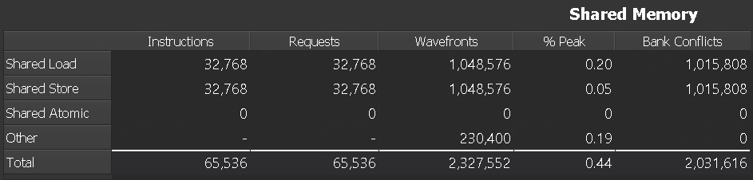
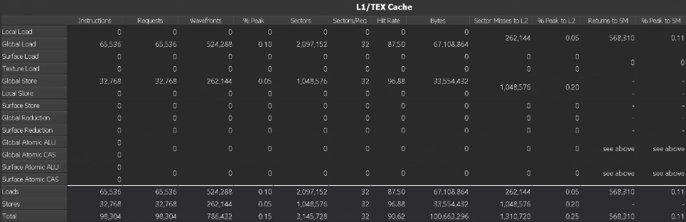
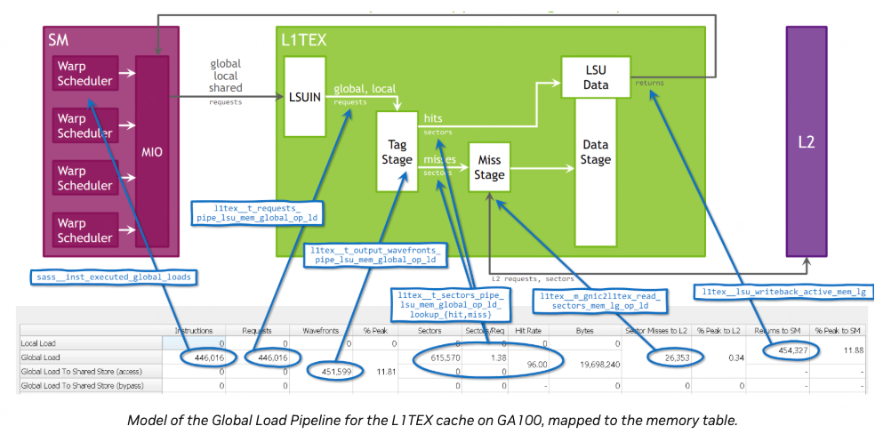
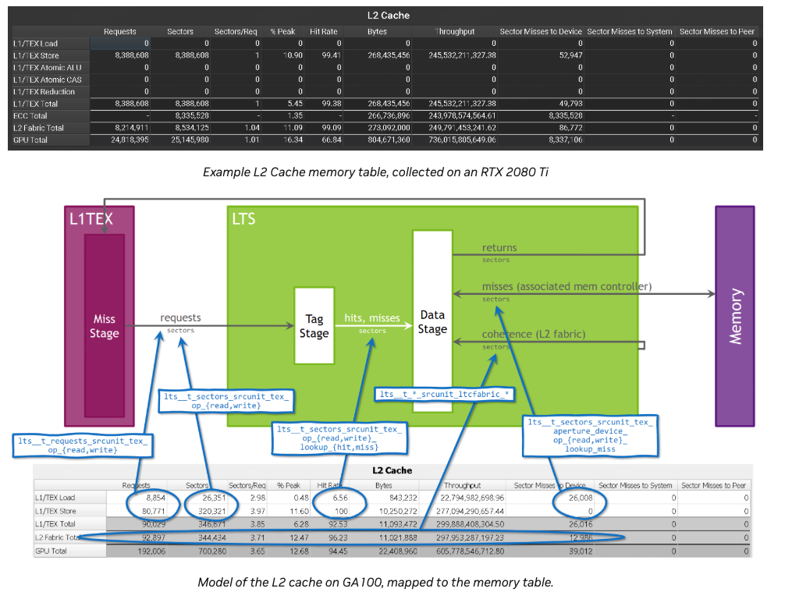
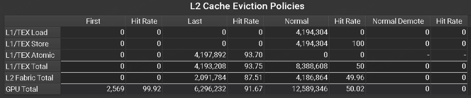
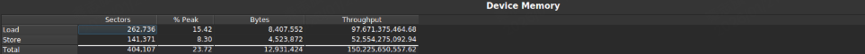

memory table展示了各种内存硬件单元的具体指标，比如shared memory、cache、device memory。

# 1 Shared Memory

## 列
- Instructions：对于每种访问类型，每个warp 实际执行的SASS汇编指令总量。不包含predicated-off指令。比如STS指令，指向Shared Store 数量。
- Requests：对shared memory总的request数量。对于SM7.0以及后续架构，一个shared memory指令对应一个request。
- wavefronts：为了完成request而产生的wavefronts数量。多个wavefronts的执行是串行的，一个cycle只能执行一个wavefront。
- \% Peak：利用率峰值的百分比，即利用率。可以指示性能瓶颈在哪里。
- Bank Conflicts：一个warp在执行的时候，如果同一条指令，多个thread读取的数据落到了相同的memory bank，就会产生冲突。

## 行
略

## Metrics
可以通过这些选项来获取这些指标：--set full, --section MemoryWorkloadAnalysis_Tables or --metrics group:memory__shared_table。

# 2 L1/TEX Cache

## Columns

- Instructions：每个warp执行的SASS指令数量。不包含predicated-off指令。predicated-off是指哪些if else语句中，条件不满足的分支对应的指令。
- Requests：所有给L1的request数量。对于SM7.0以及后续架构，对于LSU traffic（global、local）一个L1指令对应一个request。对于texture traffic，一个指令可能生成多个request。
- wavefronts：request产生的wavefronts数量。多个wavefronts的执行是串行的，一个cycle只能执行一个wavefront。
- wavefronts \% Peak：wavefronts利用率。
- Sectors：L1 所有的sector访问数量。每个load或store request会产生一个或多个sector。
- Sectors/Req：平均每个request访问的sector数量。这个值越小，效率越高。一个sector是32个字节，对于没有分支的warp，如果是访问32bit类型数据，则最佳Sectors/Req是4，如果是64bit类型数据，则最佳Sectors/Req是8。这个指标在性能优化中很重要。
- Hit Rate：sector L1 cache命中率。如果sector miss，则需要从L2中load。
- Bytes：L1请求数据的总量大小。这等于sector数量x32。
- Sector Misses to L2：L1 cache miss sector数量。
- \% Peak to L2：L1-to-XBAR 利用率峰值的百分比。它是用来发送L2 cache 请求的。
- Returns to SM：L1 cache向SM返回数据包的数量。
- \% Peak to SM：XBAR-to_L1 利用率峰值的百分比。

## Rows
略

# 3 L2 Cache

L2 cache对应的硬件是LTS。

和L1有点类似，不展开了。

# 4 L2 Cache Eviction Policies
L2的驱逐策略。

## Columns
- First：L2 cache中使用evict_first策略访问的sector数量。如果发生了驱逐需求，这类sector会优先被驱逐。
- Hit Rate：使用evict_first策略的sector的cache命中率。
- Last：使用evict_last策略访问的sector数量。如果发生了驱逐需求，这类sector会最后被驱逐。至少在evict_first、evict_normal sector被驱逐完之前不会被驱逐。
- Hit Rate：使用evict_last策略的sector的cache命中率。
- Normal：使用evict_normal策略访问的sector数量。这是默认的策略。
- Hit Rate：使用evict_normal策略的sector的cache命中率。
- Normal Demote：使用evict_normal_demote策略的sector数量。这个驱逐策略允许降级。
- Hit Rate：使用evict_normal_demote策略的sector的cache命中率。
## Rows
略

# 5 Device Memory

## Columns
- sectors：来自L2 Cache请求的sector数量
- \% Peak：平均device memory利用率。
- Bytes：L2 cache和device memory之间传输的数据总量大小。
- Throughput：达成的device memory 吞吐量。单位是GB/s。

