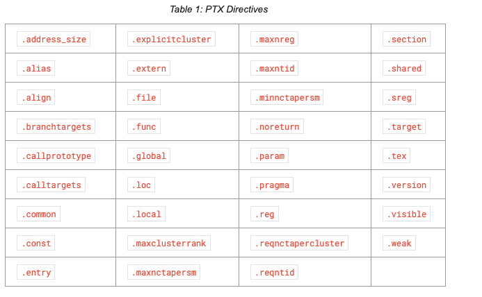
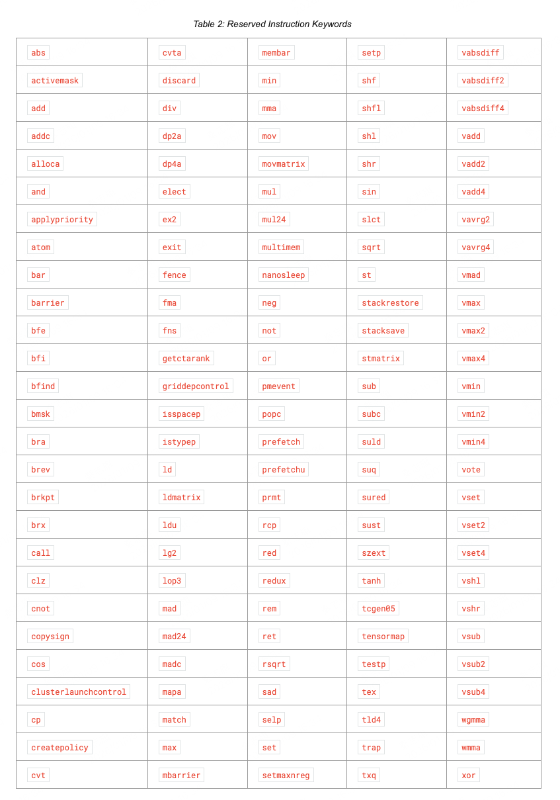
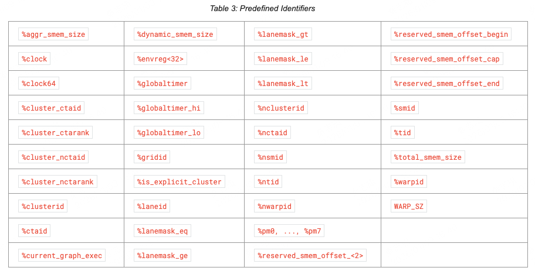

PTX程序是文本文件的集合，PTX源码是汇编语言的语法，由指令和操作数组成。操作符和寻址。

## 4.1 Source Format
源码是ascii文本文件，行之间由\n分割。
所有空格符号都是相同的，包括tab和空格。
"#" 代表预处理，类似c/c++的预处理符号
#include, #define, #if, #ifdef, #else, #endif, #line, #file

PTX是大小写敏感的。关键字都是小写的。
每个ptx module必须以`.version` 开头，用于指定ptx的版本。接着`.target` 用于指定目标架构。

## 4.2 Comments

单行注释：//
多行注释：/* */

## 4.3 Statements

每条语句是一个指令，语句开头可以有一个label，语句结尾必须有一个分号。
例如：
``` ptx
        .reg     .b32 r1, r2;
        .global  .f32  array[N];

start:  mov.b32   r1, %tid.x;
        shl.b32   r1, r1, 2;          // shift thread id by 2 bits
        ld.global.b32 r2, array[r1];  // thread[tid] gets array[tid]
        add.f32   r2, r2, 0.5;        // add 1/2
```

### 4.3.1 Directive Statements
Directive 是指示符，比如上面的.reg，是PTX 汇编语言中，用来“描述程序结构和元信息”的语法元素，而不是会在 GPU 上执行的机器指令。mov这种是指令，会在GPU上执行。

指示符以.开头，PTX中的指示符如下所示：


### 4.3.2 Instruction Statements
指令语句，比如上面的mov.b32。指令的格式是：
```
opcode <comma-separated list of operands>;
```
操作数可以是寄存器变量，常量表达式，地址表达式，或者label name。

指令可以有一个可选的guard predicate，它可以用于控制指令是否执行。guard predicate在label后面，在opcode前面，一般是%p，p是一个predicate 寄存器。也可以是%!p。

dst 操作数在前面，src操作数在后面。

操作数如下所示：


## 4.4 Identifiers

用户自定义的标识符遵循c++命名规则：
```
followsym:   [a-zA-Z0-9_$]
identifier:  [a-zA-Z]{followsym}* | {[_$%]{followsym}+
```
PTX并没有约束变量名的最大长度，至少支持1024长度。
PTX有一些预定义好的变量名称：


## 4.5 Constants

PTX支持integer和floating-point constant，以及constant expressions。
